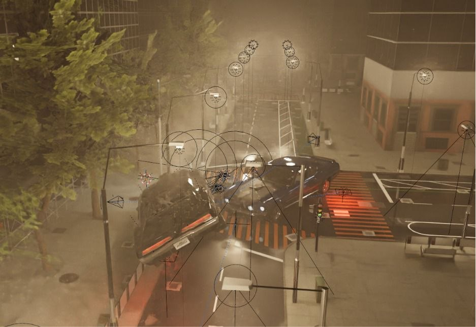
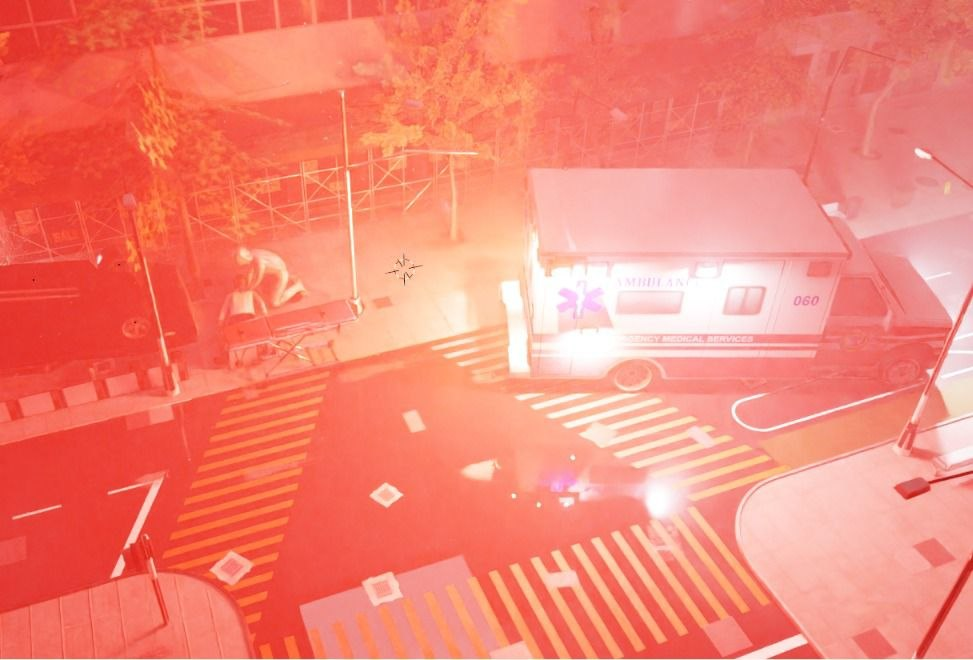
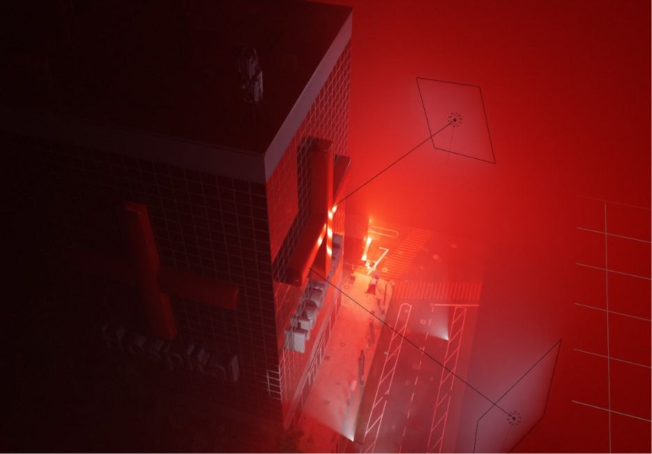

# Virtual Ambulance Emergency Response Simulation

### A Blender-Based 3D Medical Emergency Training Visualization

**Final Course Project — Computer Graphics and Visualization (SBEG353/SBES140)**
**Spring 2025/2026 — Cairo University**

---

## 🏥 Project Overview

**Virtual Ambulance Emergency Response Simulation** is a comprehensive 3D visualization project that models a complete urban emergency medical response workflow. The simulation walks through a multi-scene virtual environment encompassing:

- City streets with traffic infrastructure
- A night-time accident site with vehicle collision and on-scene response
- Patient evacuation and ambulance transport
- Hospital interiors with reception and patient handover
- A hospital fire-emergency overlay with secondary ambulance dispatch

The project demonstrates the practical application of core computer graphics concepts, including environment modeling, UV mapping and texturing, skeletal character animation with inverse kinematics, physics-based rigid-body and particle simulation, multi-source lighting design, and object/character collision handling.

---

## 👥 Team Members & Contributions

The team consists of **six members**. In line with the course's requirement that workload scale with team size, responsibilities were divided so that each member owns one comparable, end-to-end area of the project — spanning environment modeling, a hero object, character/animation work, lighting, physics, or post-production.

| # | Member | Student ID | Contribution Area | Details |
|---|--------|------------|--------------------|---------|
| 1 | **Jana Gamal Abdelzaher** | 91240240 | Urban Environment & Outdoor Lighting | City block, road network, and building modeling; street-lamp and directional lighting setup for all outdoor scenes |
| 2 | **Maryam Hosney** | student_id2 | Hero Object — Ambulance Vehicle | Full modeling, UV unwrapping, texture creation, and PBR material setup for the ambulance (livery, light bar, decals) |
| 3 | **Mohaned Hassan** | 9231261 | Hero Object — Stretcher & Character Rigging | Stretcher modeling; humanoid rigging for paramedic and patient characters; stretcher-push animation with IK constraints |
| 4 | **Hamdy** | student_id4 | Hospital Interior, Receptionist Animation & Voice-Over | Hero object — reception desk; hospital interior modeling; receptionist character animation; fire/alarm emergency lighting; **voice-over narration for the final demonstration video** |
| 5 | **Kareem Fareed** | student_id5 | Physics Simulation | Rigid-body vehicle collision dynamics for the traffic accident; rain particle system for atmospheric weather effects |
| 6 | **Mohammed Abdelrazek** | student_id6 | Rendering & Post-Production | Cycles render configuration and optimization; fire particle system for the hospital roof; compositing and final video editing |

> **Note:** Please replace the placeholder student IDs (`student_id2`, `student_id4`, `student_id5`, `student_id6`) with the correct values before final submission.

---

## ⚙️ Technical Specifications

| Category | Specification |
|----------|----------------|
| **Software** | Blender 3.x |
| **Render Engine** | Cycles (Path Tracing) |
| **Resolution** | 1920 × 1080 pixels |
| **Samples** | 256 samples per pixel (adaptive sampling enabled) |
| **Denoising** | OptiX AI Denoiser |
| **Simulation Rate** | 60 frames per second (physics) |
| **Polygon Count** | ~15,000 triangles (ambulance) |
| **Character Rig** | 65 bones per character (including finger chains) |

---

## 🎥 Final Video Showcase

<div align="center">
  <video width="800" controls>
    <source src="./assets/videos/final_video.mp4" type="video/mp4">
    Your browser does not support the video tag.
  </video>
  <br>
  <sub><i>Complete Emergency Response Simulation — narrated walkthrough of all three scenarios</i></sub>
</div>

---

## 🌆 Virtual Environment

### Urban Street and City Block
The primary outdoor environment represents a dense urban district modeled from reference photographs of mid-rise commercial blocks, with careful attention to scale and proportion between vehicles, pedestrians, and buildings.

**Key features:**
- High-rise glass office towers with grid-pattern façades
- Multi-lane intersection with pedestrian crosswalks
- Street lamps with warm point lighting, traffic signals, and planted trees
- PBR materials: glass panels with specular BSDF, concrete with diffuse-rough BSDF
- Asphalt road surfaces with tuned roughness values

### Hospital Exterior and Interior
A dedicated hospital building features a prominent red-cross emblem and a ground-floor glazed entrance, following contemporary hospital architecture with clean geometric lines.

**Interior elements:**
- Curved wooden desk labeled "Welcome / Reception"
- Office chairs and flat-panel monitors
- CAUTION: WET FLOOR sign and wheelchair
- Department signage (Intensive Care Unit, Emergency Department, Radiology)
- Material variety: wood shader with anisotropic reflections, specular terrazzo flooring, transparent BSDF glass partitions

### Accident Site
A night-time urban intersection serves as the accident site, chosen for dramatic lighting potential and contrast between emergency vehicles and the dark environment.

**Features:**
- Two-car collision with debris particles
- Volumetric fog via a Volume Scatter node in the world shader
- Dynamic street lighting and misty atmospheric conditions

---

## 🚑 Hero Objects

Per the project specification, a team of six requires **three hero objects** (⌈6/2⌉ = 3), modeled entirely from scratch by the team.

### 1. Ambulance Vehicle (Centerpiece)
- **Modeling:** Box-modeling from a subdivision-surface base mesh
- **Polygon Count:** ~15,000 triangles
- **Details:** Side mirrors, windshield wipers, door handles, roof-mounted emergency lighting array
- **Texturing:** Individually UV-unwrapped body panels, roof light bar, side doors, Star-of-Life decal, and "EMERGENCY MEDICAL SERVICES / Keep Back" livery
- **Materials:** Specular maps for environmental reflection, normal maps for panel-line depth

### 2. Medical Stretcher
- **Modeling:** Primitive cylinders (legs, wheel axles), cubes (frame rails), subdivided plane (mattress)
- **Design:** Standard hospital stretcher dimensions with adjustable backrest geometry
- **Materials:** Orange vinyl upholstery (rough diffuse shader), stainless-steel frame (metallic PBR)
- **Optimization:** Instanced wheel geometry for a lightweight mesh

### 3. Hospital Reception Desk
- **Modeling:** Circular arc extruded along the Z-axis with a beveled top (2 m radius)
- **Texture:** Wood-grain texture (1K albedo + roughness + normal) via smart UV unwrapping
- **Typography:** Embossed "Welcome" text using Blender's text-to-mesh workflow

---

## 🧍 Character System

### Character Archetypes
1. **Receptionist** — male, dark business suit with tie
2. **Paramedic** — white hazmat-style jumpsuit, blue gloves, medical vest
3. **Patient** — white shirt and dark trousers (civilian casualty)

### Rigging System
- **Skeleton:** Full humanoid armature, 65 bones including finger chains and facial control bones
- **Spine hierarchy:** root → pelvis → spine1–3 → neck → head chain
- **IK constraints:** Applied to wrists and ankles for realistic grip and foot placement
- **Source:** Base meshes from Mixamo, refined and rigged in Blender

### Animations Created
| Animation | Description |
|-----------|--------------|
| **Phone Call** | Receptionist holds receiver to ear with natural arm position and subtle body sway |
| **Stretcher Push** | Paramedic pushes loaded stretcher with a walking cycle synchronized to forward motion |
| **Patient Lying** | Supine rest pose on stretcher with arms resting on chest |
| **Triage Crouch** | Paramedic crouches beside fallen patient using lower-body IK |
| **Walking** | Bystander walk cycle with natural arm swing and gait |

---

## 🎬 Emergency Scenarios

Three scenarios were implemented, satisfying the requirement of ⌈6/2⌉ = 3 scenarios for a six-person team.

### Scenario 1: Traffic Collision and On-Scene Response 🚗💥
A black classic car collides with a stopped vehicle at a fog-covered night intersection.
- **Physics:** Rigid-body simulation with vehicle tipping onto its side
- **Visual effects:** Dynamic headlight and street-lamp lighting, dramatic shadows
- **Response:** Ambulance arrival, scene assessment, and patient extraction
- **Atmosphere:** Volumetric fog with particle-based rain and debris

<div align="center">
  
  <br>
  <sub><i>Traffic Collision and On-Scene Response</i></sub>
</div>

### Scenario 2: Patient Evacuation by Stretcher 🏥🚑
Following the collision, the patient is loaded onto the stretcher and transported to the waiting ambulance.
- **Character-object interaction:** Paramedic's hands constrained to the stretcher handle via IK targets
- **Animation sync:** Stretcher movement timed to match the paramedic's walking pace
- **Detail:** Ambulance rear doors remain open, showcasing interior modeling

<div align="center">
  
  <br>
  <sub><i>Patient Evacuation by Stretcher</i></sub>
</div>

### Scenario 3: Hospital Arrival and Fire Emergency 🏨🔥
The ambulance arrives at the hospital, completing the emergency response chain, in two phases.

**Phase 1 — Hospital Arrival & Patient Handover**
- Ambulance pulls up to the hospital entrance with emergency lights flashing
- Paramedics unload the stretcher and wheel the patient into reception
- Receptionist interacts at the curved wooden desk during handover to hospital staff

**Phase 2 — Fire Emergency Overlay**
- A fire-alarm scenario triggers inside the hospital
- Bright red volumetric lighting floods the interior, simulating an active building fire
- Particle-based fire spreads across the roof
- A second ambulance is dispatched to the new emergency outside the burning building

<div align="center">
  
  <br>
  <sub><i>Hospital Arrival and Fire Emergency</i></sub>
</div>

---

## 💡 Lighting & Rendering

All scenes were rendered using Blender's Cycles path-tracing engine with high-quality settings.

| Light Type | Application | Technical Details |
|------------|-------------|---------------------|
| **Sun (Directional)** | Daytime outdoor scenes | Intensity 1.0, angle 0.5° for sharp shadows |
| **Point Lights** | Street-lamp illumination | ~2800K color temperature, 0.3 m radius, warm white |
| **Spotlights** | Ambulance headlamps, rear floodlight | 30° cut-off, 5° penumbra |
| **Emission Materials** | Light-bar LEDs, neon signs | Self-illumination with controlled intensity |
| **Volumetric Lighting** | Fire/alarm scenes | Red Volume Scatter medium inside the building |

---

## 🔬 Physics & Simulations

### Vehicle Impact Dynamics
- **Engine:** Blender rigid-body system, 60 fps simulation rate
- **Vehicle mass:** 1,800 kg | **Restitution:** 0.3 | **Friction:** 0.8
- **Collision shape:** Mesh
- **Baking:** 250 frames, cached as Visual Transform

### Atmospheric Weather Particles
- **Rain system:** 50,000 elongated mesh instances (scale 0.02)
- **Force fields:** −Y world-space with randomized turbulence (strength 1.5)
- **Debris system:** 3,000 spark/debris objects with high-velocity initial burst and drag

### Fire Particle System (Scenario 3)
- **Emitter:** Hospital roof surface
- **Particle count:** 5,000+
- **Motion:** Upward convection with turbulence
- **Visual:** Orange-red emissive materials with glow, synchronized with red volumetric lighting

---

## 🎙️ Audio & Narration

A scripted voice-over narration accompanies the final demonstration video, guiding the viewer through each scenario and explaining the technical features on display (environment, hero objects, character animation, lighting, and physics). Narration was recorded and synced during the final editing pass.

---

## 🛠️ Installation & Setup

### Prerequisites
- **Blender 3.x** or higher ([Download](https://www.blender.org/download/))
- **System requirements:** 8GB+ RAM, GPU with CUDA support recommended for Cycles rendering

### Setup Instructions
1. **Clone the repository:**
   ```bash
   git clone https://github.com/yourusername/virtual-ambulance-simulation.git
   cd virtual-ambulance-simulation
   ```
2. **Open Blender** and launch Blender 3.x or higher.
3. **Load the project:** open `assets/models/main_scene.blend`, or navigate to individual scenario files in `assets/animations/`.
4. **Configure render settings:** Render Properties → select Cycles → set samples (256 recommended for final render) → enable OptiX AI Denoiser.
5. **Render the animation:** Output Properties → set output format (FFmpeg video or image sequence) → Render → Render Animation (F12).

### Quick Render Tips
- For preview renders, reduce samples to 64–128
- Enable adaptive sampling for faster rendering
- Use denoising to reduce noise with fewer samples
- Render as an image sequence for easier error recovery

---

## 📦 Asset Credits

| Asset | Source | License |
|-------|--------|---------|
| City Building Pack | Sketchfab | CC-BY 4.0 |
| Street Furniture | BlenderKit | Free Tier |
| Character Base Meshes | Mixamo | Adobe EULA |
| Ambulance Textures | Textures.com | Standard |
| Tree Foliage | Botaniq (Lite) | GPL |

All hero objects (ambulance, stretcher, reception desk) were modeled entirely by team members.

---

## 🤖 AI Tools Usage

In compliance with the course AI usage policy:

| Tool | Purpose | Implementation |
|------|---------|------------------|
| **ChatGPT 4o** | Script generation for ambulance light-bar flicker animation; documentation assistance for this report | Generated Python drivers were reviewed and modified by the team |
| **Midjourney v6** | Reference mood board for scene color grading and lighting | Inspiration only — no AI-generated images used in final renders |

All creative modeling, rigging, animation, and rendering work was performed manually by team members in Blender, ensuring original artistic contribution.

---

## 🔮 Future Enhancements

| Enhancement | Description |
|--------------|---------------|
| **Interactive User Control** | Game engine integration (Unreal Engine or Godot) |
| **Patient Vital Signs** | Real-time monitoring with medical parameter visualization |
| **Branching Scenarios** | Multiple response paths for training purposes |
| **Multiplayer Support** | Team training with multiple simultaneous responders |
| **VR/AR Integration** | Immersive training with head-mounted displays |
| **Performance Analytics** | Metrics collection for training assessment |
| **Medical Equipment Interaction** | Detailed simulation of medical devices and procedures |

---

## 📄 License

This project is developed for educational purposes as part of the Computer Graphics and Visualization course (SBEG353/SBES140).

---

## 📚 References

1. Caballero, A. R., & Niguidula, J. D. (2018). Disaster Risk Management and Emergency Preparedness: A Case-Driven Training Simulation Using Immersive Virtual Reality. *Proc. 4th Int. Conf. HCI and User Experience in Indonesia*, ACM, pp. 31–37.
2. Lu, S., Xu, W., Wang, F., Li, X., & Yang, J. (2021). Serious Game: Confined Space Rescue Based on Virtual Reality Technology. *Proc. 2nd Int. Conf. Video, Signal and Image Processing*, ACM, pp. 66–73.
3. Chen, Y., Fennedy, K., Zhang, J., Sim, Y. J., Zheng, C., & Yen, C. C. (2025). Bridging Simulation and Reality: Augmented Virtuality for Mass Casualty Triage Training. *Proc. CHI '25 Conf. Human Factors in Computing Systems*, ACM, Article 36.
4. Uhl, J. C., Gutierrez, R., Regal, G., Schrom-Feiertag, H., Schuster, B., & Tscheligi, M. (2024). Choosing the Right Reality: A Comparative Analysis of Tangibility in Immersive Trauma Simulations. *Proc. CHI '24 Conf. Human Factors in Computing Systems*, ACM, Article 187.

---

**Project Supervisor:** Dr. Mohammed Rushdi, SBEG353/SBES140
